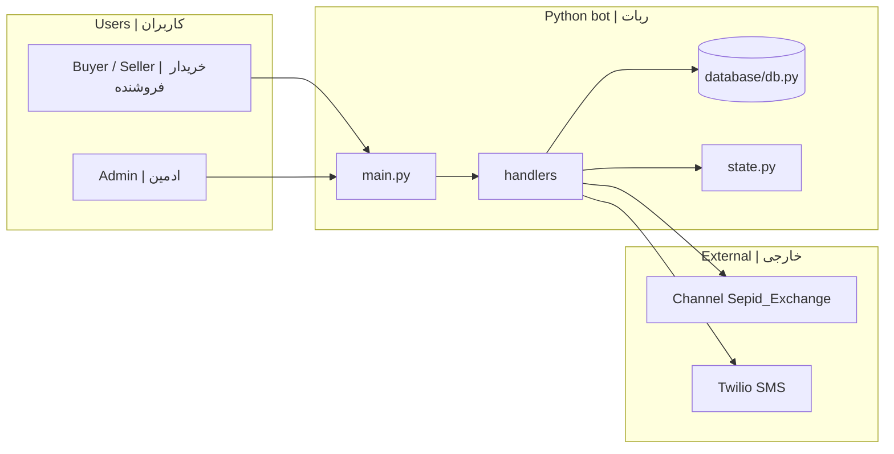
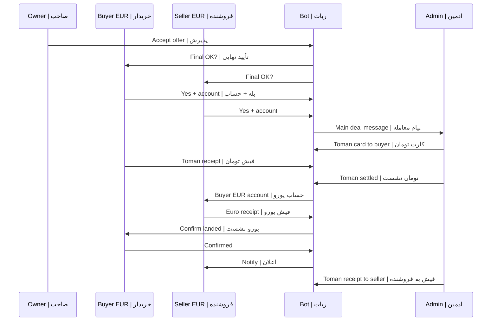

# Sepid Exchange Bot

<p align="center">
  <strong>EN:</strong> Official Telegram bot for <a href="https://t.me/Sepid_Exchange">@Sepid_Exchange</a> channel<br/>
  <strong>FA:</strong> ربات رسمی کانال <a href="https://t.me/Sepid_Exchange">@Sepid_Exchange</a><br/>
  <a href="https://t.me/Sepid_Group_Bot">@Sepid_Group_Bot</a>
</p>

> **Documentation / مستندات:** All project docs and code section banners use **English + Persian (FA)**.  
> جستجو در کد: `Section` یا `بخش` — See [docs/DEAL_GATE.md](docs/DEAL_GATE.md) for the payment flow.

---

## Table of contents | فهرست

| # | EN | FA |
|---|----|----|
| 1 | [Introduction](#introduction--معرفی) | معرفی |
| 2 | [Tech stack](#tech-stack--زبان‌ها-و-فناوری) | زبان‌ها و فناوری |
| 3 | [Features](#features--قابلیت‌ها) | قابلیت‌ها |
| 4 | [Architecture](#architecture--معماری) | معماری |
| 5 | [Deal Gate flow](#deal-gate-flow--فلو-معامله) | فلو معامله |
| 6 | [Project structure](#project-structure--ساختار-پروژه) | ساختار |
| 7 | [Install & run](#install--run--نصب-و-اجرا) | نصب |
| 8 | [Deploy](#deploy--دیپلوی) | دیپلوی |
| 9 | [Code docs](#code-documentation--مستندات-کد) | مستندات کد |
| 10 | [Security](#security--امنیت) | امنیت |

---

## Introduction | معرفی

**EN:** This bot powers **Sepid Exchange**: user registration (SMS), euro buy/sell ads on the channel, offers on posts, and after acceptance a **Deal Gate** for final confirmation, account collection, and staged Toman/Euro payments coordinated by admin.

**FA:** این ربات **سپید اکسچنج** را پشتیبانی می‌کند: ثبت‌نام با SMS، آگهی خرید/فروش یورو در کانال، پیشنهاد روی پست‌ها، و پس از پذیرش **دروازه معامله (Deal Gate)** برای تأیید نهایی، جمع حساب، و واریز مرحله‌ای تومان/یورو با ادمین.

---

## Tech stack | زبان‌ها و فناوری

**EN:** This repository is written almost entirely in **Python 3.10+**. There is no separate frontend (no React/Node for the bot itself).

**FA:** تقریباً تمام این مخزن با **پایتون ۳.۱۰+** نوشته شده است. فرانت‌اند جدا (مثل React) برای خود ربات وجود ندارد.

| Kind | EN | FA | Examples in repo |
|------|----|----|------------------|
| **Language** | Python 3.10+ | زبان اصلی | `main.py`, `handlers/*.py`, `database/db.py`, `utils/*.py` |
| **Markup / docs** | Markdown | مستندات | `README.md`, `docs/*.md` |
| **Shell** | Bash (optional) | اسکریپت سرور | `scripts/*.py` (Python), deploy commands in README |
| **SQL** | SQLite schema & queries | پایگاه داده | embedded in `database/db.py` |
| **Config** | `.env` key=value | تنظیمات محیط | `.env.sepid.example` (not committed) |

**EN — Main libraries:** `python-telegram-bot` (Telegram API), `python-dotenv`, `twilio` (SMS OTP). Optional: Pillow, OpenCV, pydantic (receipt/OCR modules).

**FA — کتابخانه‌های اصلی:** `python-telegram-bot` (API تلگرام)، `twilio` (کد ثبت‌نام). اختیاری: Pillow/OpenCV برای OCR فیش.

**EN — Not used for the bot core:** JavaScript, TypeScript, Java, C#, PHP, Go.

**FA — در هستهٔ ربات استفاده نشده:** JavaScript، Java، PHP و غیره.

---

## Features | قابلیت‌ها

| Area | EN | FA |
|------|----|----|
| Registration | Name, mobile, OTP, channel rules | نام، موبایل، OTP، قوانین |
| Euro ads | Buy/sell, Toman rate, fees, channel post | خرید/فروش، نرخ، کارمزد، کانال |
| Exchange | Euro-to-Euro ads | معاوضه یورو |
| Offers | Gate, rate, country, negotiation | پیشنهاد، نرخ، مذاکره |
| Deal Gate | Final OK, accounts, receipts, settlement | تأیید نهایی، حساب، فیش، نشست |
| Admin | Users, ads, deals, bank cards, message log | کاربران، آگهی، معامله، کارت |
| Bonbast | Daily rate post (optional) | نرخ روزانه بن‌بست |
| Iran panel | `/txin` `/txout` sync (admin) | همگام تراکنش |

---

## Architecture | معماری



| Layer | EN | FA | File |
|-------|----|----|------|
| Entry | Application, handler groups, jobs | ورود، گروه هندلر | `main.py` |
| State | `UserState` per user step | مرحله کاربر | `models/enums.py` |
| Session | Draft data in memory | پیش‌نویس موقت | `state.py` |
| DB | SQLite persistence | پایگاه داده | `database/db.py` |
| UI | Menus | منوها | `keyboards/` |

### Handler groups | گروه‌های هندلر

| Group | EN | FA |
|-------|----|----|
| -1 | Registration / restrictions | ثبت‌نام / محدودیت |
| 0 | Deal gate receipts & accounts (high priority) | فیش و حساب معامله |
| 1 | Ad/offer wizard text | ویزارد آگهی/پیشنهاد |
| 6 | Euro flow | فلو یورو |
| 8 | Admin router | پنل ادمین |

---

## Deal Gate flow | فلو معامله

**EN:** After the ad owner **accepts** an offer, `start_deal_final_gate` runs. Full callbacks and DB columns: **[docs/DEAL_GATE.md](docs/DEAL_GATE.md)** (bilingual).

**FA:** پس از **پذیرش** پیشنهاد، `start_deal_final_gate` اجرا می‌شود. callbackها و ستون‌های DB: **[docs/DEAL_GATE.md](docs/DEAL_GATE.md)**.

### Summary diagram | خلاصه فلو



### Buy vs sell ads | آگهی خرید و فروش

**EN:** `buyer_telegram_id` / `seller_telegram_id` are fixed per offer via `_offer_buyer_seller_telegram_ids`; only financial labels depend on `operation` (خرید/فروش).

**FA:** نقش خریدار/فروشنده یورو با `_offer_buyer_seller_telegram_ids` ثابت است؛ فقط متن مالی از `operation` آگهی محاسبه می‌شود.

### Related files | فایل‌های مرتبط

| File | EN | FA |
|------|----|----|
| `handlers/deal_gate.py` | Gate + admin payments | دروازه + واریز |
| `handlers/offers.py` | Admin HTML message | پیام ادمین |
| `database/db.py` | `offer_deal_gates` | جدول gate |
| `utils/deal_outbound.py` | Outbound message log | لاگ پیام |
| `main.py` | Routers & callbacks | مسیریابی |

---

## Project structure | ساختار پروژه

```text
telegram_bot_project2/
├── main.py              # EN: entry | FA: ورود
├── config/settings.py   # EN: .env | FA: تنظیمات
├── database/db.py       # EN: SQLite | FA: دیتابیس
├── handlers/
│   ├── deal_gate.py     # EN: deal gate | FA: دروازه معامله ★
│   ├── offers.py        # EN: offers | FA: پیشنهاد
│   └── ...
├── docs/
│   ├── CODE_OVERVIEW.md # EN+FA code map
│   └── DEAL_GATE.md     # EN+FA payment flow ★
└── scripts/
```

---

## Install & run | نصب و اجرا

**EN:** Python 3.10+, BotFather token, bot as **channel admin**, Twilio for OTP.

**FA:** پایتون ۳.۱۰+، توکن ربات، ربات **ادمین کانال**، Twilio برای OTP.

```bash
git clone https://github.com/soha15167/Sepid_Exchange_Bot.git
cd Sepid_Exchange_Bot
python -m venv venv
pip install -r requirements.txt
cp .env.sepid.example .env
```

| Variable | EN | FA |
|----------|----|----|
| `BOT_TOKEN` | Bot token | توکن |
| `ADVERT_CHANNEL_ID` | Channel id `-100…` | شناسه کانال |
| `ADMIN_IDS` | Admin Telegram ids | ادمین |
| `BANK_CARDS` | Toman deposit cards text | کارت‌های واریز |
| `DATABASE_NAME` | Path to `eurobot.db` | مسیر DB |

```bash
python scripts/init_fresh_database.py   # fresh DB | دیتابیس تازه
python main.py                            # run | اجرا
python -c "from database.db import ensure_schema; ensure_schema()"  # after deploy
```

---

## Deploy | دیپلوی

**EN:** Production server example: `root@49.13.132.230` → `/root/telegram_bot_project2`.  
**FA:** سرور نمونه: `root@49.13.132.230` → `/root/telegram_bot_project2`.

### Transferring code **with** explanations | انتقال کد **همراه توضیحات**

**EN:**

1. **Git (recommended)** — `git pull` on the server updates **all** source files **and** docs. Inline comments (`# Section N | بخش N`, `# EN:` / `# FA:`) live **inside** `.py` files, so they are on the server as soon as those files are pulled.
2. **SCP (partial)** — Copying only `handlers/deal_gate.py` (etc.) moves **code + in-file bilingual comments** for that file. Copy `README.md` and `docs/` separately if you want the same guides on the server disk.
3. **GitHub** — Commits (e.g. `8d21cbc`) include documented code; clone/pull is the easiest way to keep server and docs in sync.

**FA:**

1. **Git (پیشنهادی)** — با `git pull` روی سرور، هم **کد** و هم **README/docs** به‌روز می‌شود. توضیحات داخل فایل‌های `.py` (بخش‌ها و EN/FA) **با همان فایل** منتقل می‌شوند.
2. **SCP (جزئی)** — با `scp` فقط همان فایلی که می‌فرستید می‌رود؛ توضیحات داخل همان `.py` هست. برای README و `docs/` باید جداگانه کپی کنید.
3. **GitHub** — کامیت‌ها شامل کد مستندشده است؛ clone/pull ساده‌ترین همگام‌سازی است.

| What | On GitHub | On server after `git pull` | On server after `scp` one `.py` |
|------|-----------|----------------------------|----------------------------------|
| Python logic | Yes | Yes | Yes (that file only) |
| In-code EN/FA comments | Yes | Yes | Yes (that file only) |
| README + `docs/` | Yes | Yes | Only if you copy them |

```bash
# EN: On server — full update with documentation
# FA: روی سرور — به‌روزرسانی کامل با مستندات
cd /root/telegram_bot_project2
git pull origin main
./venv/bin/python3 -m pip install -r requirements.txt
./venv/bin/python3 -c "from database.db import ensure_schema; ensure_schema()"
systemctl restart telegram-bot
```

**EN — SCP example (Windows → server), same files you changed:**

**FA — نمونه SCP (ویندوز → سرور)، همان فایل‌های تغییرکرده:**

```text
scp "C:\Users\Sohei\Desktop\Desktop\telegram_bot_project2\handlers\deal_gate.py" "root@49.13.132.230:/root/telegram_bot_project2/handlers/"
scp "C:\Users\Sohei\Desktop\Desktop\telegram_bot_project2\README.md" "root@49.13.132.230:/root/telegram_bot_project2/"
scp "C:\Users\Sohei\Desktop\Desktop\telegram_bot_project2\docs\DEAL_GATE.md" "root@49.13.132.230:/root/telegram_bot_project2/docs/"
```

**EN:** The running bot uses **Python bytecode from `.py` files**; Markdown on the server is for **humans** (SSH, reading on disk), not executed by the bot.

**FA:** ربات فقط **فایل‌های `.py`** را اجرا می‌کند؛ Markdown روی سرور برای **خواندن توسط شما** است، نه اجرا توسط ربات.

---

## Code documentation | مستندات کد

| Document | EN | FA |
|----------|----|----|
| [CODE_OVERVIEW.md](docs/CODE_OVERVIEW.md) | Architecture & file map | نقشه کد |
| [DEAL_GATE.md](docs/DEAL_GATE.md) | Payment flow & callbacks | فلو واریز |
| `*.py` module docstrings | Top of each file | ابتدای فایل |
| `# Section N \| بخش N` | In-file section banners | بنر بخش در کد |

### Commit messages | پیام کامیت

**EN:** Prefer bilingual subject when touching docs: English line + Persian line in body.

**FA:** برای تغییرات مستندات: عنوان انگلیسی + توضیح فارسی در body کامیت.

Example | نمونه:

```text
docs: bilingual README and deal-gate section comments

مستندات: README و بخش‌بندی deal_gate به فارسی و انگلیسی.
```

---

## Security | امنیت

**EN:** Never commit `.env` or `*.db`. Keep tokens on server only.

**FA:** `.env` و `*.db` را commit نکنید. توکن فقط روی سرور.

---

## License | لایسنس

**EN:** Private project — no public use without permission.

**FA:** پروژه خصوصی — استفاده بدون اجازه مجاز نیست.
