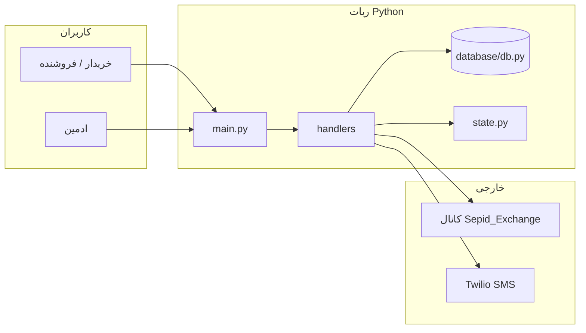
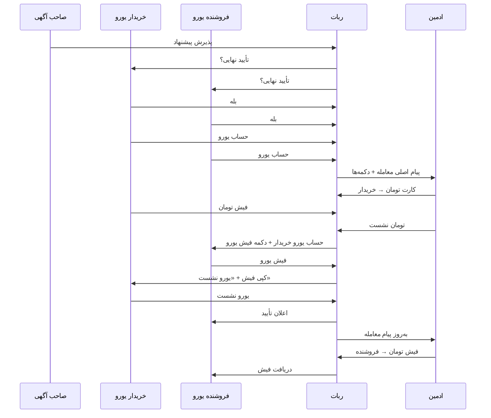

# Sepid Exchange Bot

<p align="center">
  <strong>ربات رسمی کانال <a href="https://t.me/Sepid_Exchange">@Sepid_Exchange</a></strong><br/>
  <a href="https://t.me/Sepid_Group_Bot">@Sepid_Group_Bot</a> — ثبت‌نام، آگهی یورو، پیشنهاد، و هماهنگی معامله
</p>

---

## فهرست

1. [معرفی](#معرفی)
2. [قابلیت‌ها](#قابلیت‌ها)
3. [معماری](#معماری)
4. [فلو معامله (Deal Gate)](#فلو-معامله-deal-gate)
5. [ساختار پروژه](#ساختار-پروژه)
6. [نصب و اجرا](#نصب-و-اجرا)
7. [دیپلوی](#دیپلوی-روی-سرور)
8. [مستندات کد](#مستندات-کد)
9. [امنیت](#امنیت)

---

## معرفی

این ربات تلگرام برای کانال **Sepid Exchange** ساخته شده است تا:

- کاربران با **SMS (Twilio)** ثبت‌نام کنند و نام نمایشی یکتا در آگهی‌ها داشته باشند.
- آگهی **خرید / فروش یورو** (نرخ تومان) یا **معاوضه Euro به Euro** در کانال منتشر شود.
- روی هر پست کانال، فلو **پیشنهاد** (موافقت با آگهی یا پیشنهاد با مقدار/نرخ جدید) اجرا شود.
- پس از **پذیرش پیشنهاد**، **دروازه معامله (Deal Gate)** تأیید نهایی دوطرفه، جمع حساب، و هماهنگی واریز تومان/یورو با ادمین را مدیریت کند.

---

## قابلیت‌ها

| حوزه | توضیح |
|------|--------|
| **ثبت‌نام** | نام، موبایل، OTP، قوانین کانال |
| **آگهی یورو** | خرید/فروش با نرخ تومان، کارمزد، انتشار در کانال |
| **معاوضه** | Euro به Euro با فیلدهای جدا |
| **پیشنهاد** | گیت، نرخ، کشور حساب، مذاکره، پذیرش/رد صاحب آگهی |
| **Deal Gate** | تأیید نهایی، حساب، کارت تومان، فیش‌ها، تأیید نشستن یورو |
| **ادمین** | کاربران، آگهی‌ها، پیشنهادها، معاملات، کارت‌های بانکی، لاگ پیام‌ها |
| **Bonbast** | پست روزانه نرخ ارز در کانال (اختیاری) |
| **پنل ایران** | `/txin` / `/txout` برای همگام‌سازی تراکنش (ادمین) |

---

## معماری



| لایه | فایل | نقش |
|------|------|-----|
| ورود | `main.py` | ساخت `Application`، گروه هندلرها، JobQueue |
| State | `models/enums.py` | `UserState` — مرحلهٔ فعلی کاربر |
| حافظهٔ موقت | `state.py` | `user_data_store` — پیش‌نویس آگهی/پیشنهاد |
| پایدار | `database/db.py` | SQLite (`eurobot.db`) |
| UI | `keyboards/` | منوی اصلی، پنل ادمین |

### گروه‌های هندلر پیام (مهم)

```text
Group -1  → access_gate (ثبت‌نام / محدودیت)
Group  0  → deal_gate (فیش، حساب معامله) — اولویت بالا
Group  1  → wizard متن (آگهی/پیشنهاد)
Group  6  → euro_flow
Group  8  → admin_router
```

---

## فلو معامله (Deal Gate)

پس از **پذیرش پیشنهاد** توسط صاحب آگهی، `start_deal_final_gate` اجرا می‌شود.  
جزئیات کامل، جدول callbackها و ستون‌های DB: **[docs/DEAL_GATE.md](docs/DEAL_GATE.md)**

### خلاصه مراحل



### آگهی **خرید** و **فروش**

نقش خریدار/فروشنده یورو **جابه‌جا نمی‌شود** — همان شناسه‌های `buyer_telegram_id` / `seller_telegram_id` در gate ذخیره می‌شوند؛ فقط **متن مالی** و «چه کسی تومان می‌دهد» از روی `operation` آگهی محاسبه می‌شود (`handlers/offers.py`).

### فایل‌های مرتبط

| فایل | بخش |
|------|-----|
| `handlers/deal_gate.py` | تمام فلو gate، ادمین، فیش |
| `handlers/offers.py` | اعلان HTML ادمین، خریدار/فروشنده، مبلغ تومان |
| `database/db.py` | جدول `offer_deal_gates` و توابع receipt |
| `utils/deal_outbound.py` | لاگ پیام‌های ربات به طرفین |
| `main.py` | ثبت callback و router گروه ۰/۴ |

---

## ساختار پروژه

```text
telegram_bot_project2/
├── main.py                 # ورود برنامه، ثبت هندلرها
├── config/settings.py      # .env → تنظیمات
├── database/db.py          # SQLite، migration، deal_gate CRUD
├── state.py                # user_data_store
├── models/enums.py         # UserState
├── handlers/
│   ├── deal_gate.py        # ★ دروازه معامله + واریز
│   ├── offers.py           # پیشنهاد + اعلان ادمین
│   ├── euro_flow.py        # آگهی خرید/فروش
│   ├── exchange_flow.py    # معاوضه
│   ├── admin.py            # پنل ادمین
│   ├── registration.py     # ثبت‌نام
│   └── ...
├── keyboards/              # منوها
├── utils/                  # کانال، SMS، deal_outbound، …
├── docs/
│   ├── CODE_OVERVIEW.md    # نقشهٔ کلی کد
│   └── DEAL_GATE.md        # ★ راهنمای کامل deal gate
├── scripts/                # init DB، backup، …
└── tests/
```

---

## نصب و اجرا

### پیش‌نیاز

- Python 3.10+
- توکن [@BotFather](https://t.me/BotFather)
- ربات **ادمین کانال** با حق ارسال
- Twilio برای OTP

### نصب

```bash
git clone https://github.com/soha15167/Sepid_Exchange_Bot.git
cd Sepid_Exchange_Bot
python -m venv venv
# Windows:  venv\Scripts\activate
# Linux:    source venv/bin/activate
pip install -r requirements.txt
cp .env.sepid.example .env
# مقادیر را در .env پر کنید
```

### متغیرهای مهم `.env`

| متغیر | توضیح |
|--------|--------|
| `BOT_TOKEN` | توکن ربات |
| `CHANNEL_USERNAME` | مثلاً `Sepid_Exchange` |
| `ADVERT_CHANNEL_ID` | `-100…` |
| `ADMIN_USER_ID` / `ADMIN_IDS` | ادمین(ها) |
| `DATABASE_NAME` | مسیر `eurobot.db` |
| `ADVERT_ID_START` | اولین شماره آگهی پس از DB تازه |
| `BANK_CARDS` | کارت‌های واریز تومان (متن چندخطی) |
| `TWILIO_*` | SMS |

### دیتابیس تازه

```bash
python scripts/init_fresh_database.py
```

### اجرا

```bash
python main.py
```

پس از هر deploy با ستون جدید:

```bash
python -c "from database.db import ensure_schema; ensure_schema()"
```

---

## دیپلوی روی سرور

مسیر نمونه: `/root/telegram_bot_project2`

```bash
cd /root/telegram_bot_project2
./venv/bin/python3 -m pip install -r requirements.txt
./venv/bin/python3 -c "from database.db import ensure_schema; ensure_schema()"
systemctl restart telegram-bot
```

انتقال فایل (ویندوز → سرور):

```text
scp "C:\Users\Sohei\Desktop\Desktop\telegram_bot_project2\handlers\deal_gate.py" "root@49.13.132.230:/root/telegram_bot_project2/handlers/"
```

---

## نرخ روزانه Bonbast

ساعت پیش‌فرض **۱۲:۰۰ تهران** — `BONBAST_DAILY_POST_ENABLED=1` در `.env`.  
تست ادمین: `/post_rates`

---

## مستندات کد

| سند | محتوا |
|-----|--------|
| [docs/CODE_OVERVIEW.md](docs/CODE_OVERVIEW.md) | معماری، جداول، لیست handlers |
| [docs/DEAL_GATE.md](docs/DEAL_GATE.md) | فلوچارت و callback معامله |
| ابتدای هر ماژول `.py` | docstring دو‌زبانه + بخش‌بندی با کامنت |

ماژول‌های اصلی deal gate دارای **بنر بخش** (`# === بخش N ===`) در داخل فایل هستند — جستجو در `deal_gate.py` با «بخش».

---

## امنیت

- `.env` و `*.db` را commit نکنید.
- توکن و Twilio فقط روی سرور.
- لاگ outbound فقط برای بازپخش ادمین است، نه عمومی.

---

## لایسنس

پروژهٔ خصوصی کانال Sepid Exchange — استفاده بدون اجازه مجاز نیست.
