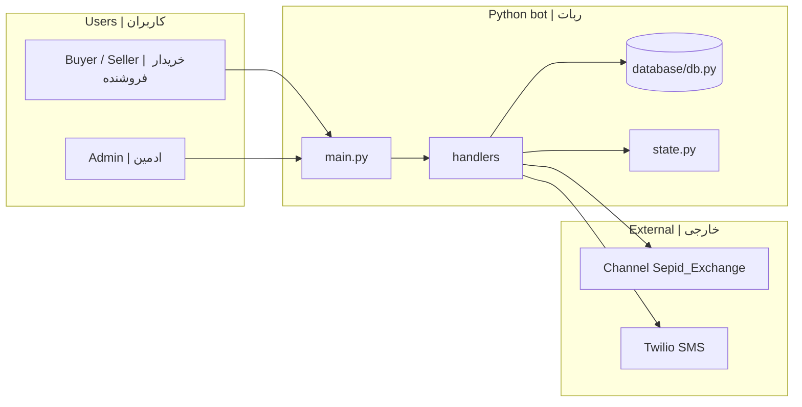
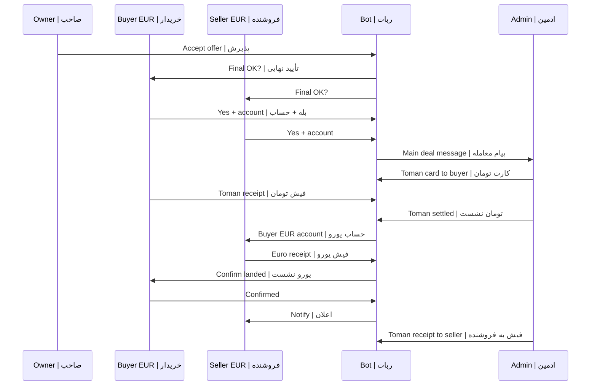

# Sepid Exchange Bot

<p align="center">
  <strong>EN:</strong> Official Telegram bot for <a href="https://t.me/Sepid_Exchange">@Sepid_Exchange</a> channel<br/>
  <strong>FA:</strong> ربات رسمی کانال <a href="https://t.me/Sepid_Exchange">@Sepid_Exchange</a><br/>
  <a href="https://t.me/Sepid_Group_Bot">@Sepid_Group_Bot</a>
</p>

> **EN:** Docs and code use English + Persian. Search code: `Section` or `بخش`.  
> **FA:** مستندات و کد به دو زبان انگلیسی و فارسی است. در کد: `Section` یا `بخش`. فلو واریز: [docs/DEAL_GATE.md](docs/DEAL_GATE.md)

---

## Table of contents | فهرست

| # | EN | FA |
|---|----|----|
| 1 | [Introduction](#introduction--معرفی) | معرفی |
| 2 | [Tech stack](#tech-stack--زبان‌ها-و-فناوری) | زبان‌ها و فناوری |
| 3 | [Features](#features--قابلیت‌ها) | قابلیت‌ها |
| 4 | [Architecture](#architecture--معماری) | معماری |
| 5 | [Deal Gate flow](#deal-gate-flow--فلو-معامله) | فلو معامله |
| 6 | [Project structure](#project-structure--ساختار-پروژه) | ساختار |
| 7 | [Install & run](#install--run--نصب-و-اجرا) | نصب |
| 8 | [Deploy](#deploy--دیپلوی) | دیپلوی |
| 9 | [Code docs](#code-documentation--مستندات-کد) | مستندات کد |
| 10 | [Security](#security--امنیت) | امنیت |

---

## Introduction | معرفی

### English

This bot runs **Sepid Exchange**: SMS registration, euro buy/sell channel ads, offers on posts, and after acceptance a **Deal Gate** (final OK, accounts, staged Toman/Euro payments with admin).

### فارسی

این ربات **سپید اکسچنج** را اجرا می‌کند: ثبت‌نام با پیامک، آگهی خرید و فروش یورو در کانال، پیشنهاد روی پست‌ها، و بعد از پذیرش پیشنهاد **دروازه معامله** برای تأیید نهایی، دریافت حساب، و هماهنگی واریز تومان و یورو با ادمین.

---

## Tech stack | زبان‌ها و فناوری

### English

Almost the entire project is **Python 3.10+**. There is no separate web frontend (no React/Node for the bot).

| Kind | Role | Examples |
|------|------|----------|
| Language | Python 3.10+ | `main.py`, `handlers/`, `database/`, `utils/` |
| Docs | Markdown | `README.md`, `docs/` |
| Database | SQLite (SQL in Python) | `database/db.py` |
| Config | `.env` (not in git) | `.env.sepid.example` |

**Main libraries:** `python-telegram-bot`, `python-dotenv`, `twilio`.  
**Optional:** Pillow, OpenCV, pydantic (receipt/OCR).  
**Not used in the bot core:** JavaScript, TypeScript, Java, C#, PHP, Go.

### فارسی

تقریباً همهٔ پروژه با **پایتون ۳.۱۰ به بالا** نوشته شده است. رابط وب جدا (مثل React) برای خود ربات نداریم.

| مورد | نقش | نمونه در پروژه |
|------|-----|----------------|
| زبان | پایتون | `main.py`، پوشهٔ `handlers/`، `database/` |
| مستندات | مارک‌داون | `README.md`، پوشهٔ `docs/` |
| دیتابیس | SQLite | فایل `database/db.py` |
| تنظیمات | فایل `.env` | فقط روی سرور؛ داخل گیت نیست |

**کتابخانه‌های اصلی:** اتصال به تلگرام (`python-telegram-bot`)، خواندن `.env`، ارسال پیامک ثبت‌نام (`twilio`).  
**اختیاری:** Pillow و OpenCV برای تشخیص متن/عکس فیش.  
**در هستهٔ ربات به کار نرفته:** جاوااسکریپت، جاوا، PHP، Go و مشابه آن‌ها.

---

## Features | قابلیت‌ها

| Area | EN | FA |
|------|----|----|
| Registration | Name, mobile, OTP, channel rules | نام، موبایل، OTP، قوانین |
| Euro ads | Buy/sell, Toman rate, fees, channel post | خرید/فروش، نرخ، کارمزد، کانال |
| Exchange | Euro-to-Euro ads | معاوضه یورو |
| Offers | Gate, rate, country, negotiation | پیشنهاد، نرخ، مذاکره |
| Deal Gate | Final OK, accounts, receipts, settlement | تأیید نهایی، حساب، فیش، نشست |
| Admin | Users, ads, deals, bank cards, message log | کاربران، آگهی، معامله، کارت |
| Bonbast | Daily rate post (optional) | نرخ روزانه بن‌بست |
| Iran panel | `/txin` `/txout` sync (admin) | همگام تراکنش |

---

## Architecture | معماری



| Layer | EN | FA | File |
|-------|----|----|------|
| Entry | Application, handler groups, jobs | ورود، گروه هندلر | `main.py` |
| State | `UserState` per user step | مرحله کاربر | `models/enums.py` |
| Session | Draft data in memory | پیش‌نویس موقت | `state.py` |
| DB | SQLite persistence | پایگاه داده | `database/db.py` |
| UI | Menus | منوها | `keyboards/` |

### Handler groups | گروه‌های هندلر

| Group | EN | FA |
|-------|----|----|
| -1 | Registration / restrictions | ثبت‌نام / محدودیت |
| 0 | Deal gate receipts & accounts (high priority) | فیش و حساب معامله |
| 1 | Ad/offer wizard text | ویزارد آگهی/پیشنهاد |
| 6 | Euro flow | فلو یورو |
| 8 | Admin router | پنل ادمین |

---

## Deal Gate flow | فلو معامله

**EN:** After the ad owner **accepts** an offer, `start_deal_final_gate` runs. Full callbacks and DB columns: **[docs/DEAL_GATE.md](docs/DEAL_GATE.md)** (bilingual).

**FA:** پس از **پذیرش** پیشنهاد، `start_deal_final_gate` اجرا می‌شود. callbackها و ستون‌های DB: **[docs/DEAL_GATE.md](docs/DEAL_GATE.md)**.

### Summary diagram | خلاصه فلو



### Buy vs sell ads | آگهی خرید و فروش

**EN:** `buyer_telegram_id` / `seller_telegram_id` are fixed per offer via `_offer_buyer_seller_telegram_ids`; only financial labels depend on `operation` (خرید/فروش).

**FA:** نقش خریدار/فروشنده یورو با `_offer_buyer_seller_telegram_ids` ثابت است؛ فقط متن مالی از `operation` آگهی محاسبه می‌شود.

### Related files | فایل‌های مرتبط

| File | EN | FA |
|------|----|----|
| `handlers/deal_gate.py` | Gate + admin payments | دروازه + واریز |
| `handlers/offers.py` | Admin HTML message | پیام ادمین |
| `database/db.py` | `offer_deal_gates` | جدول gate |
| `utils/deal_outbound.py` | Outbound message log | لاگ پیام |
| `main.py` | Routers & callbacks | مسیریابی |

---

## Project structure | ساختار پروژه

```text
telegram_bot_project2/
├── main.py              # EN: entry | FA: ورود
├── config/settings.py   # EN: .env | FA: تنظیمات
├── database/db.py       # EN: SQLite | FA: دیتابیس
├── handlers/
│   ├── deal_gate.py     # EN: deal gate | FA: دروازه معامله ★
│   ├── offers.py        # EN: offers | FA: پیشنهاد
│   └── ...
├── docs/
│   ├── CODE_OVERVIEW.md # EN+FA code map
│   └── DEAL_GATE.md     # EN+FA payment flow ★
└── scripts/
```

---

## Install & run | نصب و اجرا

**EN:** Python 3.10+, BotFather token, bot as **channel admin**, Twilio for OTP.

**FA:** پایتون ۳.۱۰+، توکن ربات، ربات **ادمین کانال**، Twilio برای OTP.

```bash
git clone https://github.com/soha15167/Sepid_Exchange_Bot.git
cd Sepid_Exchange_Bot
python -m venv venv
pip install -r requirements.txt
cp .env.sepid.example .env
```

| Variable | EN | FA |
|----------|----|----|
| `BOT_TOKEN` | Bot token | توکن |
| `ADVERT_CHANNEL_ID` | Channel id `-100…` | شناسه کانال |
| `ADMIN_IDS` | Admin Telegram ids | ادمین |
| `BANK_CARDS` | Toman deposit cards text | کارت‌های واریز |
| `DATABASE_NAME` | Path to `eurobot.db` | مسیر DB |

```bash
python scripts/init_fresh_database.py   # fresh DB | دیتابیس تازه
python main.py                            # run | اجرا
python -c "from database.db import ensure_schema; ensure_schema()"  # after deploy
```

---

## Deploy | دیپلوی

سرور نمونه: `root@49.13.132.230` — مسیر: `/root/telegram_bot_project2`

### English — How updates reach the server

| Method | When to use |
|--------|-------------|
| **SCP** | Your server folder was copied manually (no `.git`) — **this is your case if `git pull` fails** |
| **Git pull** | After you connect the folder to GitHub once (see below) |

Comments in code (`# Section | بخش`) travel **inside** each `.py` file you copy.  
Markdown (`README`, `docs/`) is for reading on the server; the bot does not execute it.

### فارسی — چطور کد به سرور می‌رسد

| روش | کی استفاده کنیم |
|-----|------------------|
| **SCP** | پوشهٔ سرور با کپی دستی ساخته شده و `git pull` خطا می‌دهد — **احتمالاً وضعیت فعلی شما** |
| **Git pull** | بعد از یک‌بار وصل کردن پوشه به گیت‌هاب (دستورات پایین) |

توضیحات داخل کد همراه همان فایل `.py` منتقل می‌شود.  
فایل‌های مارک‌داون فقط برای مطالعهٔ شما روی سرور است؛ ربات آن‌ها را اجرا نمی‌کند.

---

### روش ۱ — SCP (بدون گیت) | Method A — SCP

**فارسی — بعد از هر تغییر در ویندوز:**

```text
scp "C:\Users\Sohei\Desktop\Desktop\telegram_bot_project2\handlers\deal_gate.py" "root@49.13.132.230:/root/telegram_bot_project2/handlers/"
scp "C:\Users\Sohei\Desktop\Desktop\telegram_bot_project2\handlers\offers.py" "root@49.13.132.230:/root/telegram_bot_project2/handlers/"
scp "C:\Users\Sohei\Desktop\Desktop\telegram_bot_project2\database\db.py" "root@49.13.132.230:/root/telegram_bot_project2/database/"
scp "C:\Users\Sohei\Desktop\Desktop\telegram_bot_project2\main.py" "root@49.13.132.230:/root/telegram_bot_project2/"
```

**روی سرور:**

```bash
cd /root/telegram_bot_project2
./venv/bin/python3 -c "from database.db import ensure_schema; ensure_schema()"
systemctl restart telegram-bot
```

**English:** Copy changed files from Windows, then `ensure_schema` and restart the service.

---

### روش ۲ — یک‌بار گیت روی سرور (بعداً `git pull`) | Method B — Git once

**فارسی:** اگر `fatal: not a git repository` می‌گیرید، یعنی پوشه با SCP ساخته شده و هنوز گیت ندارد.  
**فقط اگر `eurobot.db` و `.env` را بکاپ گرفتید** می‌توانید پوشه را به ریپو وصل کنید:

```bash
cd /root/telegram_bot_project2
# پشتیبان (مهم)
cp eurobot.db /root/eurobot.db.bak
cp .env /root/.env.bak

# اتصال به گیت‌هاب (یک‌بار)
git init
git remote add origin https://github.com/soha15167/Sepid_Exchange_Bot.git
git fetch origin
git checkout -B main origin/main

# بعد از این، به‌روزرسانی:
git pull origin main
./venv/bin/python3 -c "from database.db import ensure_schema; ensure_schema()"
systemctl restart telegram-bot
```

**هشدار:** `git checkout` ممکن است فایل‌های محلی را عوض کند؛ حتماً `.env` و `eurobot.db` را نگه دارید.

**English:** `git pull` only works after `git init` + `remote` + `checkout`. Back up `.env` and `eurobot.db` first.

---

### روش ۳ — کلون تازه در مسیر دیگر | Method C — Fresh clone

**فارسی:** امن‌تر اگر نمی‌خواهید روی پوشهٔ فعلی ریسک کنید:

```bash
cd /root
git clone https://github.com/soha15167/Sepid_Exchange_Bot.git telegram_bot_project2_git
cd telegram_bot_project2_git
cp /root/telegram_bot_project2/.env .
cp /root/telegram_bot_project2/eurobot.db .
python3 -m venv venv && ./venv/bin/pip install -r requirements.txt
./venv/bin/python3 -c "from database.db import ensure_schema; ensure_schema()"
# سپس مسیر سرویس systemd را به پوشهٔ جدید تغییر دهید
```

**English:** Clone to a new folder, copy `.env` and DB, point `systemctl` to the new path.

---

## Code documentation | مستندات کد

| Document | EN | FA |
|----------|----|----|
| [CODE_OVERVIEW.md](docs/CODE_OVERVIEW.md) | Architecture & file map | نقشه کد |
| [DEAL_GATE.md](docs/DEAL_GATE.md) | Payment flow & callbacks | فلو واریز |
| `*.py` module docstrings | Top of each file | ابتدای فایل |
| `# Section N \| بخش N` | In-file section banners | بنر بخش در کد |

### Commit messages | پیام کامیت

**EN:** Prefer bilingual subject when touching docs: English line + Persian line in body.

**FA:** برای تغییرات مستندات: عنوان انگلیسی + توضیح فارسی در body کامیت.

Example | نمونه:

```text
docs: bilingual README and deal-gate section comments

مستندات: README و بخش‌بندی deal_gate به فارسی و انگلیسی.
```

---

## Security | امنیت

**EN:** Never commit `.env` or `*.db`. Keep tokens on server only.

**FA:** `.env` و `*.db` را commit نکنید. توکن فقط روی سرور.

---

## License | لایسنس

**EN:** Private project — no public use without permission.

**FA:** پروژه خصوصی — استفاده بدون اجازه مجاز نیست.
