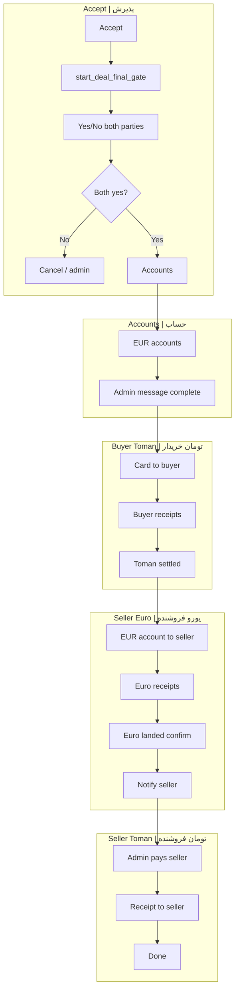

# Deal Gate | دروازه معامله

**EN:** Detailed guide for **final confirmation** and **payment coordination** after an offer is accepted.  
**FA:** راهنمای **تأیید نهایی** و **هماهنگی واریز** پس از پذیرش پیشنهاد.

**Implementation / پیاده‌سازی:** `handlers/deal_gate.py`

---

## Roles on buy & sell ads | نقش‌ها در آگهی خرید و فروش

**EN:** Euro buyer/seller Telegram IDs come from advert `operation` and the offer row — function `_offer_buyer_seller_telegram_ids` in `handlers/offers.py`.

**FA:** شناسهٔ خریدار/فروشنده یورو از `operation` آگهی و ردیف پیشنهاد — تابع `_offer_buyer_seller_telegram_ids` در `handlers/offers.py`.

| Advert type | EN: Euro buyer | EN: Euro seller | FA: خریدار یورو | FA: فروشنده یورو |
|-------------|----------------|-----------------|-----------------|------------------|
| **Sell** (owner sells) | Proposer | Ad owner | پیشنهاددهنده | صاحب آگهی |
| **Buy** (owner buys) | Ad owner | Proposer | صاحب آگهی | پیشنهاددهنده |

**EN:** Toman amounts use `buyer_deposit_toman_amount` and compact financial HTML in the admin message.  
**FA:** مبالغ تومان با `buyer_deposit_toman_amount` و خلاصه مالی در پیام ادمین.

---

## Full flowchart | فلوچارت کل

---

## gate_status values | وضعیت gate_status

| Value | EN | FA |
|-------|----|----|
| `pending` | Waiting final yes/no | انتظار تأیید نهایی |
| `accounts` | Collecting EUR accounts | جمع حساب |
| `completed` | Both accounts; payment phase | تکمیل حساب؛ واریز |
| (other) | Admin decision after 2h escalation | تصمیم ادمین |

---

## Admin buttons (staged) | دکمه‌های ادمین

**EN:** On the **main deal message** (`sync_deal_admin_notification`), buttons appear by stage.

**FA:** روی **پیام اصلی معامله**، دکمه‌ها مرحله‌ای نمایش داده می‌شوند.

| Button | Callback | EN: When shown | FA: شرط |
|--------|----------|----------------|---------|
| Toman card to buyer | `adm\|pay\|{id}` | Deal complete | همیشه پس از تکمیل |
| Toman settled | `adm\|tomset\|{id}` | Card sent, not settled | کارت فرستاده، نشست نخورده |
| Euro settled (admin) | `adm\|eurcfm\|{id}\|{idx}` | Unconfirmed euro receipt | فیش یورو بدون تأیید |
| Toman receipt to seller | `adm\|stom\|{id}\|go` | All euro receipts confirmed | همه یورو تأیید شده |
| Bot messages log | `adm\|outlog\|{id}` | Always | همیشه |

---

## Party callbacks | callback طرفین

| Party | EN: Action | FA: عمل | Callback |
|-------|------------|---------|----------|
| Buyer | Toman receipt | فیش تومان | `deal\|rcpt\|{oid}\|go` / `cancel` |
| Seller | Euro receipt | فیش یورو | `deal\|srcpt\|{oid}\|go` / `cancel` |
| Buyer | Euro landed | یورو نشست | `deal\|eurset\|{oid}\|{idx}` |

---

## DB columns | ستون‌های offer_deal_gates

| Column | EN | FA |
|--------|----|----|
| `buyer_toman_card_sent_at` | Card sent to buyer timestamp | زمان ارسال کارت |
| `buyer_receipt_log` | JSON buyer toman receipts | فیش تومان خریدار |
| `buyer_toman_settled_at` | Admin confirmed toman settled | تومان نشست |
| `seller_eur_account_sent_at` | EUR account sent to seller | حساب یورو به فروشنده |
| `seller_receipt_log` | JSON euro receipts + `buyer_confirmed_at` | فیش یورو + تأیید |
| `seller_toman_admin_log` | JSON admin toman receipts to seller | فیش تومان به فروشنده |
| `admin_notify_mids` | JSON admin chat → message id | پیام اصلی ادمین |

---

## PTB routing | مسیریابی main.py

| Group | Router | EN | FA |
|-------|--------|----|----|
| 0 | `deal_gate_group0_text_router` | Receipts, accounts, admin stom text | متن فیش و حساب |
| 4 | `deal_gate_group0_photo_router` | Receipt photos | عکس فیش |
| — | `deal_gate_callback` | `deal\|*`, `adm\|dg\|*` | callback طرفین |
| — | `deal_admin_*` | `adm\|pay\|`, `tomset`, `eurcfm`, `stom` | callback ادمین |

---

## Main menu after actions | منوی اصلی

**EN:** After receipt upload, cancel, or confirm — `_show_user_main_menu`: `admin_home_inline_keyboard` for admins, `main_menu_inline_keyboard` for users.

**FA:** پس از فیش/انصراف/تأیید — منوی اصلی؛ ادمین پنل admin_home، کاربران منوی عادی.
