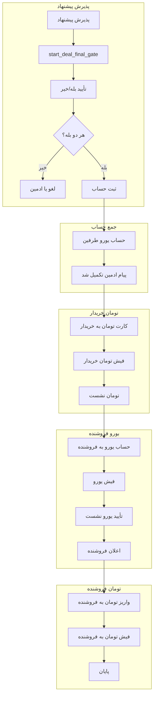

# Deal Gate — دروازه معامله / راهنمای کامل

مستند تفصیلی فلو **تأیید نهایی** و **هماهنگی واریز** پس از پذیرش پیشنهاد.  
پیاده‌سازی اصلی: `handlers/deal_gate.py`

---

## نقش‌ها در آگهی خرید و فروش

خریدار/فروشندهٔ **یورو** از نوع آگهی (`operation`) و پیشنهاد تعیین می‌شود — تابع  
`_offer_buyer_seller_telegram_ids` در `handlers/offers.py`:

| نوع آگهی | خریدار یورو (`buyer_telegram_id`) | فروشنده یورو (`seller_telegram_id`) |
|----------|-----------------------------------|-------------------------------------|
| **فروش** (صاحب می‌فروشد) | پیشنهاددهنده | صاحب آگهی |
| **خرید** (صاحب می‌خرد) | صاحب آگهی | پیشنهاددهنده |

مبالغ تومان (امانت خریدار، واریز نهایی به فروشنده) با `buyer_deposit_toman_amount` و خلاصهٔ مالی در اعلان ادمین محاسبه می‌شود.

---

## فلوچارت کل (از پذیرش تا پایان)

---

## وضعیت‌های `gate_status`

| مقدار | معنی |
|--------|------|
| `pending` | انتظار تأیید نهایی بله/خیر |
| `accounts` | جمع‌آوری حساب یورو |
| `completed` | هر دو حساب ثبت شد؛ هماهنگی واریز |
| (سایر) | تصمیم ادمین پس از اسکیلیشن ۲ ساعته |

---

## دکمه‌های ادمین (مرحله‌ای)

روی **همان پیام اصلی معامله** (`sync_deal_admin_notification`):

| دکمه | Callback | شرط نمایش |
|------|----------|------------|
| 💳 ارسال کارت واریز تومان به خریدار | `adm\|pay\|{offer_id}` | همیشه در `completed` |
| ✅ تومان نشست | `adm\|tomset\|{offer_id}` | کارت فرستاده، هنوز `buyer_toman_settled_at` خالی |
| ✅ یورو نشست (ادمین) | `adm\|eurcfm\|{offer_id}\|{idx}` | فیش یورو بدون تأیید |
| 📎 فیش تومان به فروشنده | `adm\|stom\|{offer_id}\|go` | همه فیش‌های یورو تأیید شده |
| 📋 پیام‌های ربات | `adm\|outlog\|{offer_id}` | همیشه |

---

## Callback طرفین

| طرف | عمل | Callback |
|-----|-----|----------|
| خریدار | فیش تومان | `deal\|rcpt\|{oid}\|go` / `cancel` |
| فروشنده | فیش یورو | `deal\|srcpt\|{oid}\|go` / `cancel` |
| خریدار | یورو نشست | `deal\|eurset\|{oid}\|{idx}` |

---

## ستون‌های مهم `offer_deal_gates`

| ستون | کاربرد |
|--------|--------|
| `buyer_toman_card_sent_at` | زمان ارسال کارت به خریدار |
| `buyer_receipt_log` | JSON آرایه فیش‌های تومان خریدار |
| `buyer_toman_settled_at` | ادمین «تومان نشست» زده |
| `seller_eur_account_sent_at` | حساب یورو به فروشنده رفته |
| `seller_receipt_log` | JSON فیش یورو + `buyer_confirmed_at` |
| `seller_toman_admin_log` | JSON فیش تومان ادمین به فروشنده |
| `admin_notify_mids` | JSON `{chat_id: message_id}` پیام اصلی ادمین |

---

## مسیریابی PTB (`main.py`)

| Group | Router | اولویت |
|-------|--------|--------|
| 0 | `deal_gate_group0_text_router` | فیش ادمین→فروشنده، فیش طرفین، حساب |
| 4 | `deal_gate_group0_photo_router` | عکس فیش |
| — | `deal_gate_callback` | `deal\|*` و `adm\|dg\|*` |
| — | `deal_admin_*` callbacks | `adm\|pay\|`, `tomset`, `eurcfm`, `stom`, … |

---

## منوی اصلی

پس از ارسال فیش، انصراف، یا تأیید: `_show_user_main_menu` — برای ادمین `admin_home_inline_keyboard`، برای کاربران `main_menu_inline_keyboard`.
